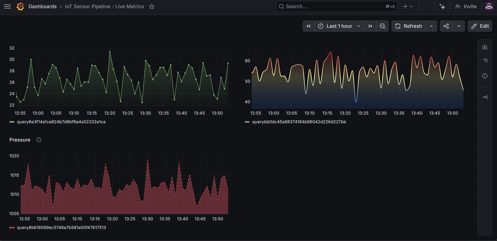
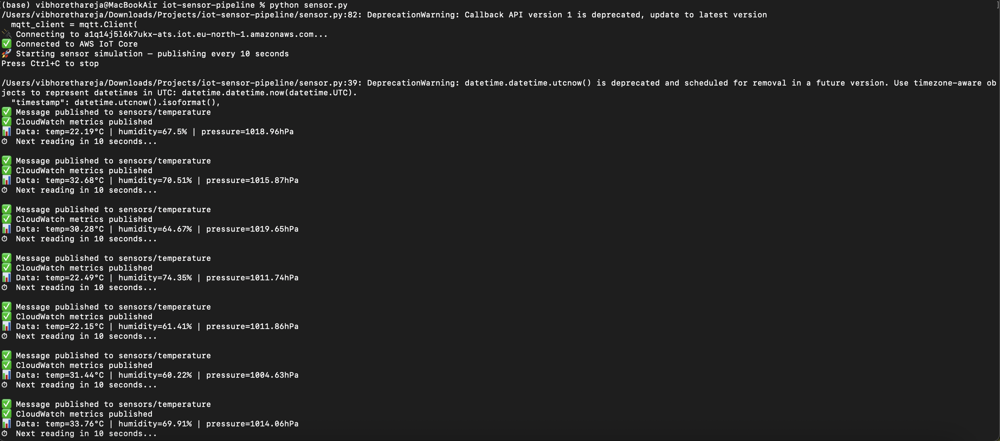
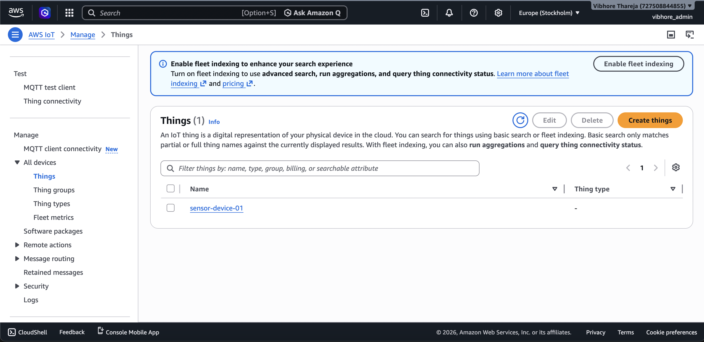
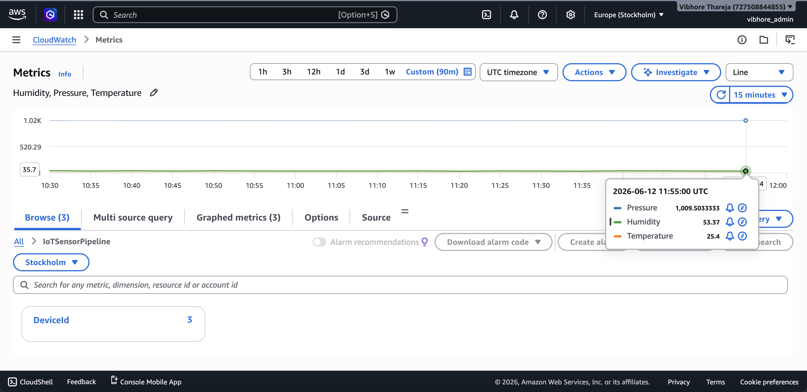
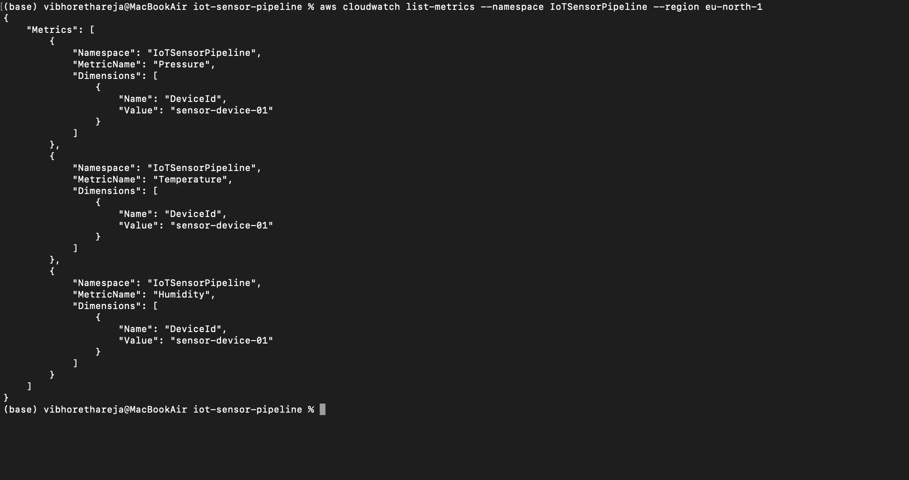

# IoT Sensor Data Pipeline

End-to-end IoT data pipeline that simulates sensor readings, 
publishes them to AWS IoT Core via MQTT, stores metrics in 
CloudWatch, and visualizes live data in a Grafana dashboard.

## Architecture

Python Sensor Simulator
↓ (MQTT over TLS port 8883)
AWS IoT Core
↓ (dual publish)
CloudWatch Custom Metrics (IoTSensorPipeline)
↓
Grafana Cloud Dashboard (live visualization)

## Tech Stack

- **Language:** Python 3
- **Protocol:** MQTT (paho-mqtt)
- **Cloud:** AWS IoT Core, AWS CloudWatch (eu-north-1)
- **Visualization:** Grafana Cloud
- **Auth:** X.509 certificates (TLS mutual authentication)

## Metrics Collected

| Metric | Unit | Range |
|---|---|---|
| Temperature | °C | 18.0 – 35.0 |
| Humidity | % | 30.0 – 80.0 |
| Pressure | hPa | 1000.0 – 1025.0 |

## Pipeline Flow

1. Python script generates realistic sensor readings every 10 seconds
2. Readings published to AWS IoT Core topic `sensors/temperature` via MQTT over TLS
3. Metrics simultaneously pushed to CloudWatch namespace `IoTSensorPipeline`
4. Grafana Cloud queries CloudWatch and renders live time-series charts
5. Dashboard auto-refreshes showing real-time sensor state

## Project Structure

iot-sensor-pipeline/
├── sensor.py           # Sensor simulator + MQTT publisher
├── requirements.txt    # Python dependencies
├── .env                # IoT endpoint config (not committed)
├── certs/              # X.509 certificates (not committed)
└── screenshots/        # Architecture proof screenshots

## Setup & Usage

### Prerequisites
- AWS account with IoT Core access
- AWS CLI configured
- Python 3.8+
- Grafana Cloud account

### Installation

```bash
# Clone the repo
git clone https://github.com/vibhorethareja/iot-sensor-pipeline.git
cd iot-sensor-pipeline

# Install dependencies
pip install -r requirements.txt
```

### Configure environment

Create a `.env` file:

AWS_IOT_ENDPOINT=xxxxxxxxxx-ats.iot.eu-north-1.amazonaws.com
AWS_REGION=eu-north-1
IOT_TOPIC=sensors/temperature

### AWS IoT Core Setup

1. Create a Thing in AWS IoT Core named `sensor-device-01`
2. Generate and download X.509 certificates
3. Attach a policy allowing `iot:Connect`, `iot:Publish`, `iot:Subscribe`
4. Place certificates in `certs/` folder

### Run the simulator

```bash
python sensor.py
```

Expected output:

🔌 Connecting to xxxxxxxxxx-ats.iot.eu-north-1.amazonaws.com...
✅ Connected to AWS IoT Core
🚀 Starting sensor simulation — publishing every 10 seconds
📊 Data: temp=24.3°C | humidity=55.2% | pressure=1013.4hPa
✅ CloudWatch metrics published
✅ Message published to sensors/temperature
⏱  Next reading in 10 seconds...

## Screenshots

### Grafana Live Dashboard


### Sensor Simulator Running


### AWS IoT Core — Thing


### CloudWatch Custom Metrics


### CloudWatch Metrics CLI Verification


## Key Concepts Demonstrated

- MQTT protocol with TLS mutual authentication via X.509 certificates
- AWS IoT Core device provisioning and policy management
- CloudWatch custom namespaces and metric dimensions
- Grafana Cloud data source configuration and dashboard building
- End-to-end IoT data pipeline from device to visualization
- Secure credential management (.env + .gitignore for certs)

## Relation to Professional Experience

This project extends hands-on IoT experience from an internship at 
Pi Labs by Pixida GmbH Berlin (2023), where similar sensor data 
pipelines were used in production IoT analytics environments.